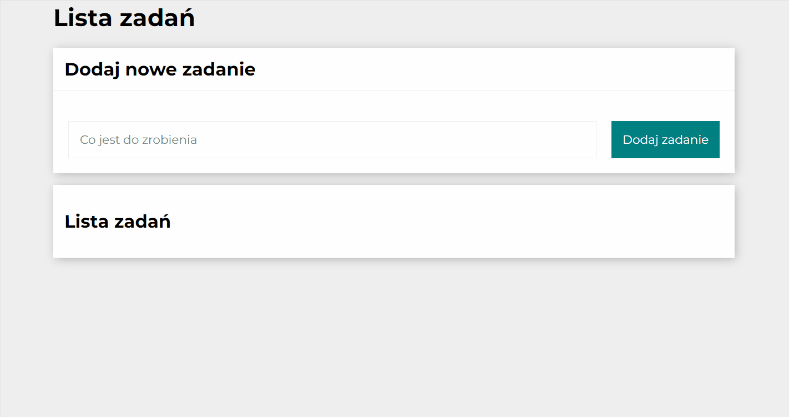

# *To do list*
This repository presents **handy check list**. The application is flexible, so it can be used on a variety of mobile devices, such as mobile phones , tablets and laptops.

## Demo
 https://ulczik.github.io/To-Do-List/

## Description
Now you wont forget what you have to do with this simple tasks list.

You may easily:
1. Add new tasks
2. Mark as done
3. Remove done tasks

Below is instruction how to use this application.

## Used technologies
- HTML
- CSS Flex Box
- BEM convention
- JavaScript ES6+	

## Features
- Grid layouts
- Media queries
